# 💰 Smart Expense Tracker

> **A modern Django-based web application to efficiently manage personal income and expenses with insightful analytics, reports, and budgeting features.**

---

# 🖼️ Project Banner

> 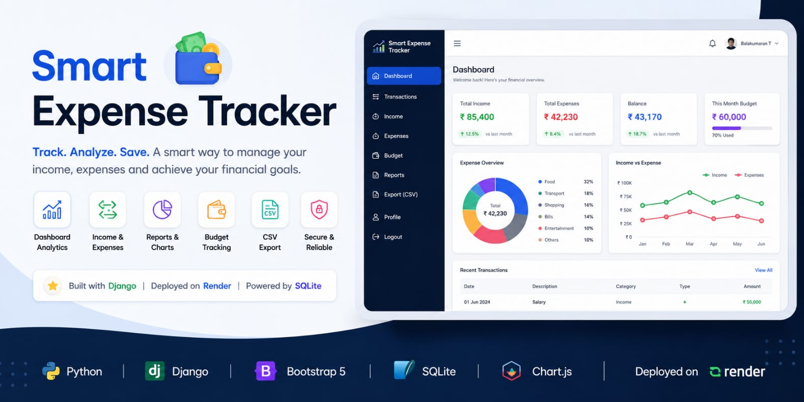

---

# 🌐 Live Demo

**🚀 Live Application:**
https://smart-expense-tracker-gbd5.onrender.com

**💻 GitHub Repository:**
https://github.com/Balakumaran-2306/Smart-Expense-Tracker

---

# 📖 Project Overview

Smart Expense Tracker is a full-stack personal finance management application built using Django. It allows users to securely track their income and expenses, monitor spending habits, visualize financial data using charts, manage budgets, generate monthly reports, and export transaction history.

The project demonstrates practical implementation of authentication, CRUD operations, database management, data visualization, deployment, and version control.

---

# ✨ Features

* 🔐 Secure User Authentication
* 💰 Income & Expense Management
* 📊 Interactive Dashboard
* 📈 Expense Analysis Charts
* 📅 Monthly Reports
* 💵 Budget Tracking
* 🔍 Search & Filter Transactions
* 📄 CSV Export
* ☁️ Live Deployment on Render
* 💻 Clean & User-Friendly Interface

---

# 🛠️ Tech Stack

| Category        | Technologies                       |
| --------------- | ---------------------------------- |
| Backend         | Python, Django                     |
| Frontend        | HTML5, CSS3, Bootstrap, JavaScript |
| Database        | SQLite                             |
| Charts          | Chart.js                           |
| Version Control | Git, GitHub                        |
| Deployment      | Render                             |
| IDE             | Visual Studio Code                 |

---

# 📸 Application Screenshots

## 🔐 Login

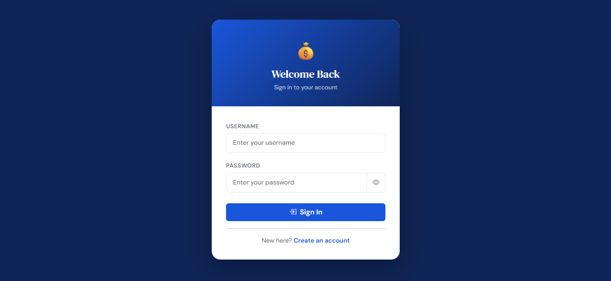

---

## 📝 Register

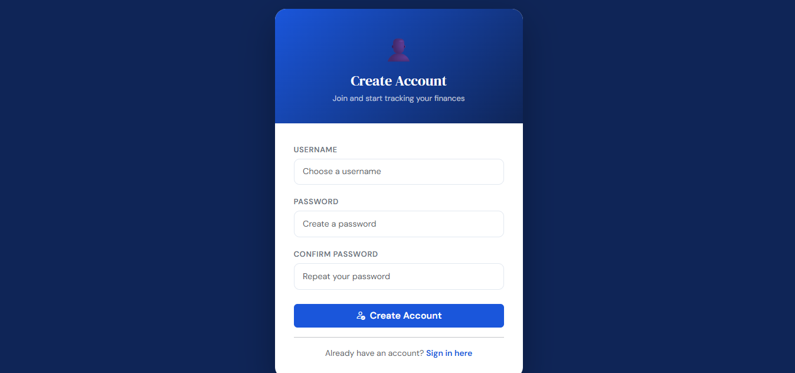

---

## 📊 Dashboard

### Overview

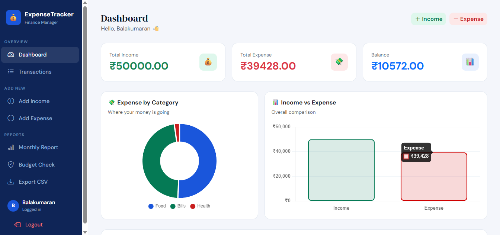

### Analytics

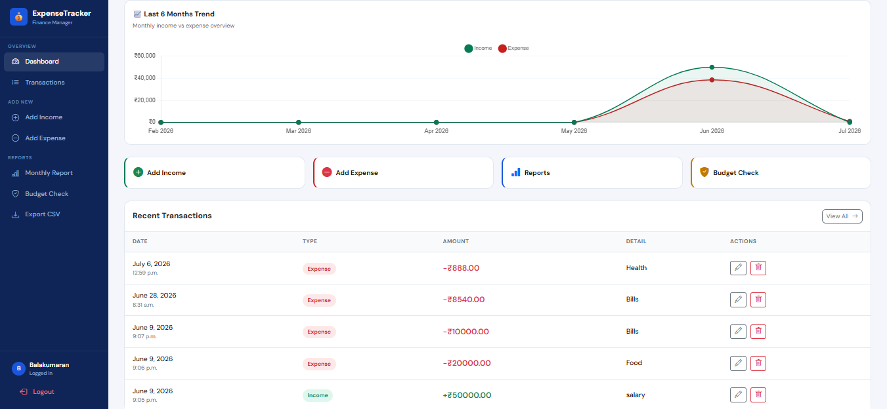

---

## 💰 Add Income

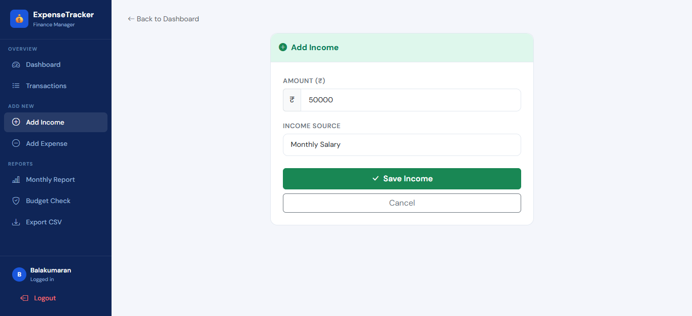

---

## 💸 Add Expense

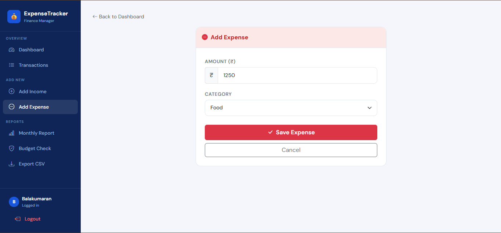

---

## 📈 Monthly Report

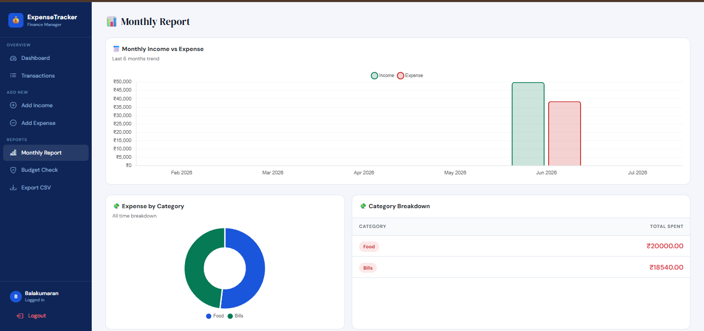

---

## 📋 Transactions

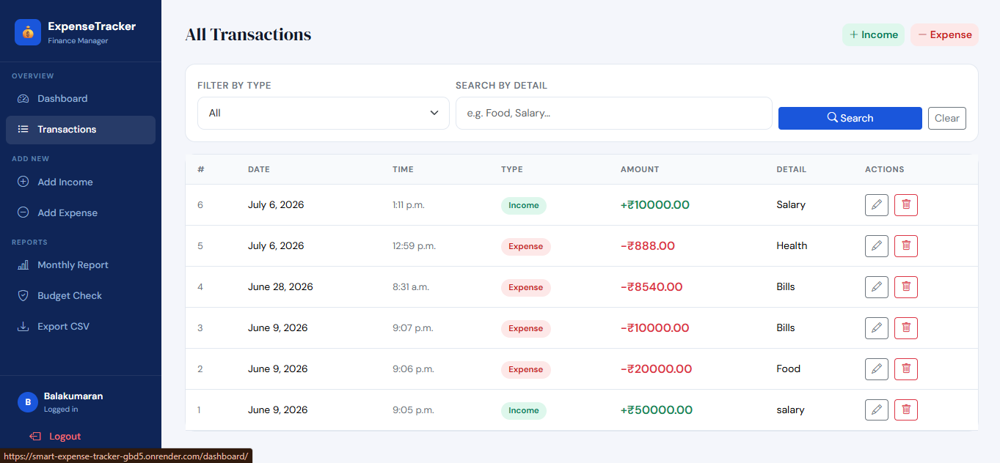

---

## 💰 Budget

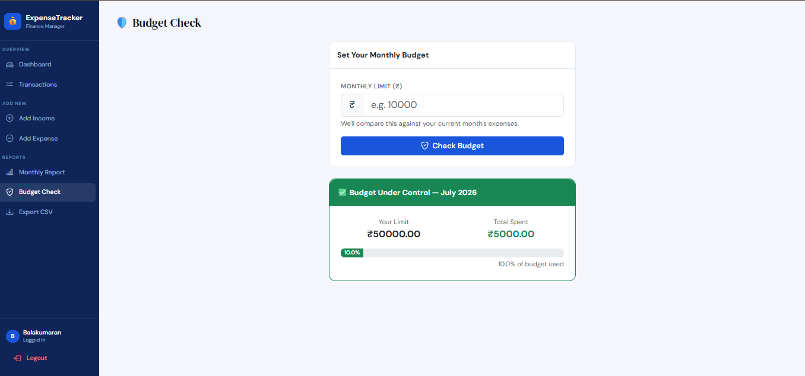

---

## 📱 Mobile View

### Dashboard

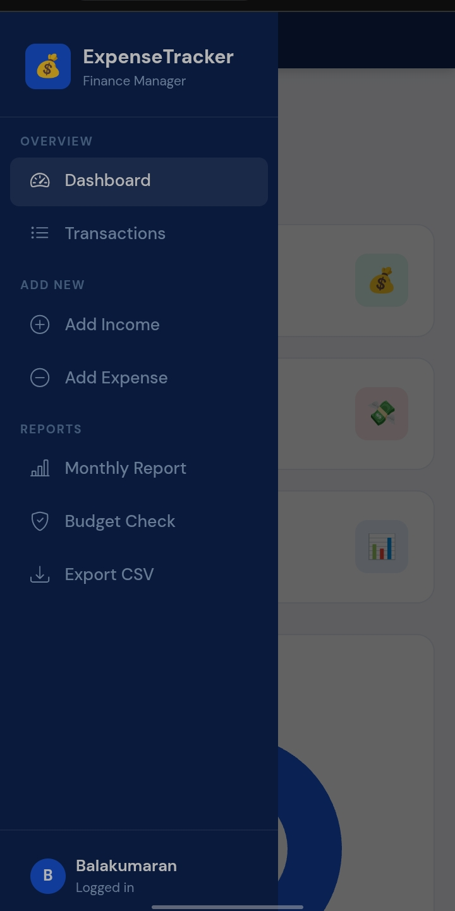

### Navigation

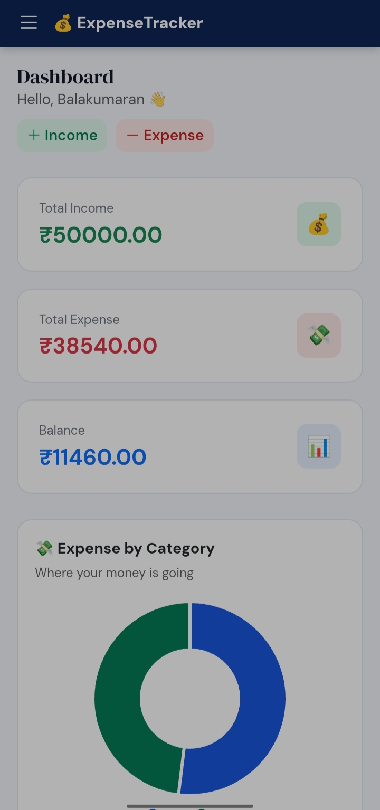

## 🎥 Project Demo

Watch the complete project walkthrough below:

[▶️ Smart Expense Tracker Demo](assets/demo-video.mp4)


# 📂 Project Structure

```text
Smart-Expense-Tracker/
│
├── expense_tracker/
│
├── tracker/
│
├── templates/
│
├── static/
│
├── manage.py
│
├── requirements.txt
│
├── build.sh
│
└── README.md
```

---

# ⚙️ Installation

### Clone Repository

```bash
git clone https://github.com/Balakumaran-2306/Smart-Expense-Tracker.git
```

### Navigate into the Project

```bash
cd Smart-Expense-Tracker
```

### Install Dependencies

```bash
pip install -r requirements.txt
```

### Apply Database Migrations

```bash
python manage.py migrate
```

### Run Development Server

```bash
python manage.py runserver
```

Open:

```
http://127.0.0.1:8000/
```

---

# 📊 Application Workflow

```
User Login/Register
        │
        ▼
Dashboard
        │
        ▼
Income / Expense Management
        │
        ▼
SQLite Database
        │
        ▼
Reports & Charts
        │
        ▼
Budget Analysis
        │
        ▼
CSV Export
```

---

# 🎯 Learning Outcomes

This project helped me strengthen my understanding of:

* Django Framework
* User Authentication
* CRUD Operations
* Django ORM
* SQLite Database
* Bootstrap UI Development
* Chart.js Integration
* Git & GitHub Workflow
* Render Deployment
* Debugging & Problem Solving

---

# 🚀 Future Enhancements

* 📱 Fully Responsive UI
* 🔒 Confirm Password Validation
* 💬 Django Flash Messages
* 📄 Empty State Messages
* 🔑 Forgot Password
* 👤 User Profile Management
* 🌙 Dark Mode
* 📑 PDF Report Export

---

# 👨‍💻 Author

**Balakumaran T**

🎓 Final Year B.E. Electronics & Communication Engineering

💼 Aspiring Software Engineer | Python & Django Developer

---

# 📬 Connect With Me

**GitHub**

>(https://github.com/Balakumaran-2306)

**LinkedIn**

>(https://www.linkedin.com/in/balakumaran-t-175a72278)

**Email**

> kumaranbala216@gmail.com

---

# ⭐ Support

If you found this project useful, please consider giving it a ⭐ on GitHub.

Your feedback and suggestions are always welcome.

---

# 📄 License

This project is created for learning, portfolio showcase, and educational purposes.
